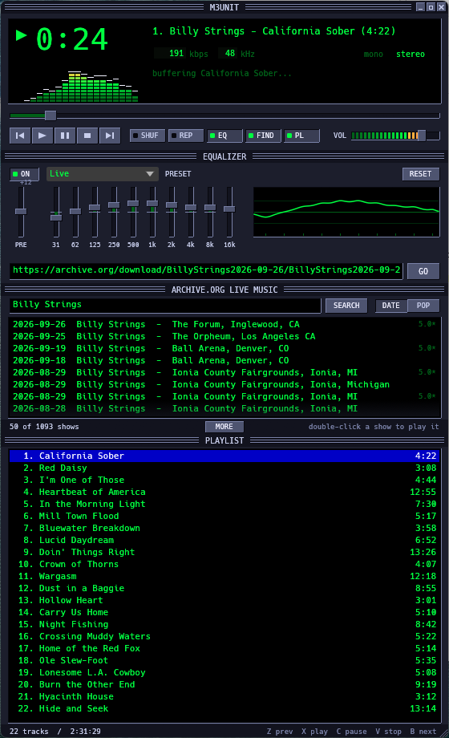

# M3UNIT

**An M3U streamer with an archive.org browser built in.**

M3UNIT is a small desktop audio player with late-90s skinned-player vibes.
Give it the URL of an `.m3u` playlist anywhere on the internet and it streams
the tracks straight from the web, no download step. A built-in browser for
archive.org's [Live Music Archive](https://archive.org/details/etree) lets you
search thousands of live shows and start playing one with a double-click.



## Features

- **Streams M3U / EXTM3U playlists** over http(s), resolving relative entries
  against the playlist URL. MP3, FLAC, Vorbis, WAV and MP4/AAC are decoded.
- **archive.org Live Music Archive browser.** Search by artist or show title,
  sort by date or popularity, page through results and double-click a show to
  load it. Only shows with MP3 derivatives are listed, so every result plays.
- **archive.org metadata enrichment.** For archive.org items the playlist
  shows real song titles and lengths instead of file names, plus the show
  title and artist in the display.
- **Gapless playback.** The next track is opened, buffered and decoded in the
  background and appended to the audio queue, so the switch happens inside the
  audio thread with no fetch pause.
- **Seekable streams** thanks to a read-ahead HTTP buffer.
- **10-band graphic equalizer** with a preamp, 13 presets and a live
  frequency-response graph.
- **Spectrum analyser**, shuffle, repeat (all / one / off), and keyboard
  shortcuts for every transport control.
- **Collapsible panels.** Hide the equalizer, the show browser or the
  playlist and the window shrinks to fit.
- **Skinned window.** No OS title bar: the app draws its own with minimize,
  maximize and close buttons. Drag the title bar to move the window,
  double-click it to maximize, and resize from the right or bottom edge.

Built in Rust with [egui](https://github.com/emilk/egui) for the window,
[rodio](https://github.com/RustAudio/rodio) (symphonia) for decoding, and
[stream-download](https://github.com/aschey/stream-download-rs) for the
read-ahead HTTP buffer.

## Download

Grab the latest Windows build (64-bit, no installer, no dependencies):

**[m3unit-v0.1.0-windows-x86_64.zip](https://github.com/jaigner-hub/m3unit/releases/download/v0.1.0/m3unit-v0.1.0-windows-x86_64.zip)**

Unzip and run `m3unit.exe`. Windows SmartScreen may warn about an unsigned
executable on first launch; choose "More info" then "Run anyway". All releases
are listed on the [releases page](https://github.com/jaigner-hub/m3unit/releases).

On Linux, build from source (see below).

## Run from source

```
cargo run --release
```

It opens with a Billy Strings show from archive.org already loaded and a
search for the band already run. Put any other http(s) `.m3u` playlist URL in
the box and hit **GO**, or use the show browser below it.

## Controls

| Action | Mouse | Keyboard |
| --- | --- | --- |
| Previous / next track | ⏮ ⏭ | `Z` / `B` |
| Play, pause, stop | ▶ ⏸ ⏹ | `X`, `C` or `Space`, `V` |
| Seek | drag the seek bar | `←` / `→` (5 s) |
| Volume | drag the VOL slider | `↑` / `↓` |
| Play a specific track | double-click it in the playlist | |
| Shuffle / repeat (all → one → off) | SHUF / REP toggles | |
| Show / hide equalizer, show browser, playlist | EQ / FIND / PL toggles | |
| Move / maximize / resize window | drag title bar / double-click it / drag right or bottom edge | |

Pressing previous more than three seconds into a track restarts it instead.

## Finding shows

The FIND toggle opens the archive.org Live Music Archive browser. Type an
artist (or any words from a show title), press Enter or SEARCH, and sort by
DATE (newest first) or POP (most downloaded). Each row shows the date, band,
venue and city, with the average rating on the right when the archive has one.
Double-click a show to load its playlist and start playing; MORE pages through
long result lists. Hover a row for the full title. A blank search lists the
whole archive.

Under the hood this queries archive.org's advanced search API for items in
the `etree` collection that have a VBR MP3 derivative, then streams the
`<identifier>_vbr.m3u` playlist that archive.org generates for those items.

## Equalizer

The EQ button in the transport row shows or hides a 10-band graphic equalizer
(ISO octave centres, 31 Hz to 16 kHz, ±12 dB) plus a preamp. Drag a fader,
double-click it to zero, or pick a preset: Flat, Rock, Pop, Live, Dance,
Classical, Jazz, Bluegrass, Acoustic, Vocal, Bass Boost, Treble Boost,
Loudness. Moving a fader after picking a preset switches the menu to
"Custom". The graph on the right shows the resulting frequency response.

Each band is an RBJ peaking biquad applied per channel before the visualizer
tap, with a soft knee above 0.9 full scale so heavy boosts don't hard-clip.

## Building on Windows

Requires the Rust toolchain (`x86_64-pc-windows-msvc`) with the Visual Studio
Build Tools. No other system dependencies: audio goes through WASAPI and TLS is
pure Rust (`rustls` + `ring`).

If **Smart App Control** is enabled, Windows may occasionally refuse to run a
freshly compiled build script ("An Application Control policy has blocked this
file", os error 4551). Re-running `cargo build` usually gets past it.

The `target/` directory can get large. If this folder is synced by OneDrive,
consider excluding `target` from sync or setting `CARGO_TARGET_DIR` elsewhere.

## Building on Linux

Needs ALSA headers and pkg-config (and the usual X11/Wayland libs for a GUI):

```
sudo apt install pkg-config libasound2-dev libxkbcommon-dev libgl1-mesa-dev
```

## Layout

```
src/main.rs      entry point: tokio runtime, TLS provider, window setup
src/app.rs       egui UI: display, spectrum, seek/volume, transport, panels, playlist
src/player.rs    audio engine: HTTP streaming -> decoder -> output device
src/playlist.rs  M3U parsing + archive.org metadata enrichment
src/archive.rs   archive.org Live Music Archive search
src/eq.rs        10-band peaking-biquad equalizer and presets
src/viz.rs       sample tap and FFT-based spectrum analyser
```

## Tests

```
cargo test
```

Covers M3U parsing, archive.org identifier and length parsing, and search
query construction.
